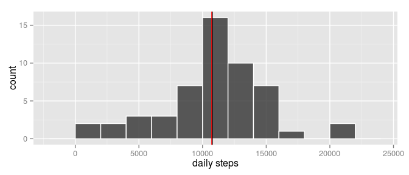
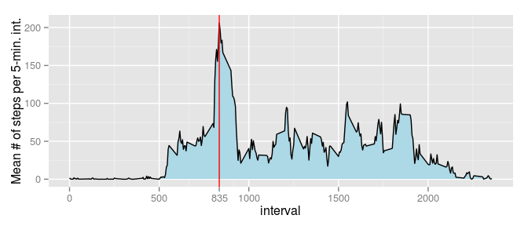
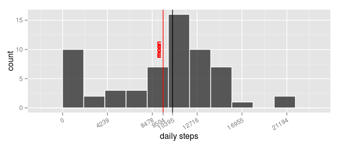
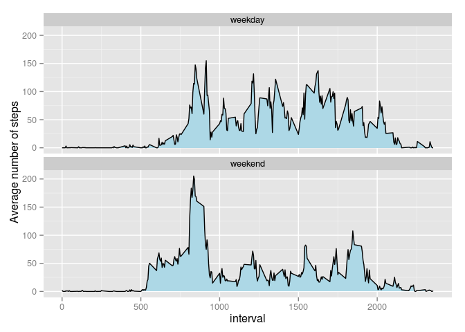

# Reproducible Research: Peer Assessment 1

## Loading and preprocessing the data
Load the necessary libraries:

```r
library(ggplot2)
library(plyr)
```

Read in the dataset:

```r
unzip('activity.zip', "activity.csv")
amd = read.csv("activity.csv", as.is=TRUE)
amd = transform(amd, date=as.Date(date))
if (file.exists("activity.csv")) file.remove("activity.csv")
```

```
## [1] TRUE
```


## What is the mean total number of steps taken per day?

```r
ats = ddply(amd[complete.cases(amd),], .(date), summarize, 
            daily_steps=sum(steps))
```

Histogram of the total number of steps taken each day:

```r
ggplot(ats, aes(x=daily_steps)) + 
    geom_histogram(binwidth=2000, colour="white", alpha=0.8) +
    geom_vline(xintercept=median(ats$daily_steps)) + 
    geom_vline(xintercept=mean(ats$daily_steps)*.995, color="red") + # to avoid overplotting
    xlab("daily steps")
```

 

The mean and median total number of steps taken per day are
10766.2 and 
10765.0, respectively.
```

## What is the average daily activity pattern?

Time series plot of the 5-minute interval (x-axis) and
the average number of steps taken, averaged across all days (y-axis)

```r
ai = ddply(amd, .(interval), summarize, imean = mean(steps, na.rm=TRUE))
imax = ai[which.max(ai$imean), 1]; amax = max(ai$imean)
ggplot(ai, aes(x=interval, y=imean)) + 
    geom_area(color=NA, fill="lightblue") + 
    geom_line() + 
    ylab("Mean # of steps per 5-min. int.") + 
    geom_vline(xintercept=imax, color="red", ylim=c(0, amax)) +
    scale_x_continuous(breaks=sort(c(seq(0, max(ai$interval), by=500), imax)))
```

 

The average number of steps across all the days in the dataset, 
is maximum for the following 5-minute interval:

```r
ai[which.max(ai$imean), 1]
```

```
## [1] 835
```

## Imputing missing values
The total number of missing values in the dataset:

```r
sum(complete.cases(amd))
```

```
## [1] 15264
```

The missing values are imputed using the median across all 5-minute intervals
of the same denomination

```r
amdi = ddply(amd, .(interval), transform, 
             isteps=ifelse(is.na(steps), median(steps, na.rm=TRUE), steps))

atsi = ddply(amdi, .(date), summarize, daily_steps=sum(isteps))
```

Histogram of the total number of steps taken each day:

```r
mdn2 = median(atsi$daily_steps); avg2 = mean(atsi$daily_steps)
ggplot(atsi, aes(x=daily_steps)) + 
    geom_histogram(binwidth=2000, colour="white", alpha=0.8) + 
    geom_vline(xintercept=mdn2) + 
    geom_vline(xintercept=avg2, colour="red") +
    geom_text(x=avg2, y=10, label="mean", colour="red", angle=90, size=3.5, vjust=-.5) + 
    scale_x_continuous(breaks=sort(c(seq(0, max(atsi$daily_steps), length.out=6), mdn2, avg2))) + 
    theme(axis.text.x = element_text(angle=30, hjust=1, vjust=1)) + 
    xlab("daily steps")
```

 

Both the mean (9503.9) and median (10395.0) total number of steps taken per day are lower for the imputed dataset and wider apart.


## Are there differences in activity patterns between weekdays and weekends?

Add a new factor variable to the imputed dataset. It has two levels - "weekday" 
and "weekend", indicating wether a given date is a weekday or weekend day.

```r
amdi$weekday = factor(ifelse(weekdays(amdi$date) %in% c("Saturday", "Sunday"), 
                      "weekday", "weekend"))
```


```r
aii = ddply(amdi, .(interval, weekday), summarize, imean = mean(isteps))
```

Panel plot containing a time series plot of the 5-minute interval (x-axis) and 
the average number of steps taken, averaged across all weekdays or 
weekend days (y-axis)

```r
ggplot(aii, aes(x=interval, y=imean)) + 
    facet_wrap(~weekday, nrow=2) + 
    geom_area(color=NA, fill="lightblue")+
    geom_line()+
    ylab("Average number of steps")
```

 
